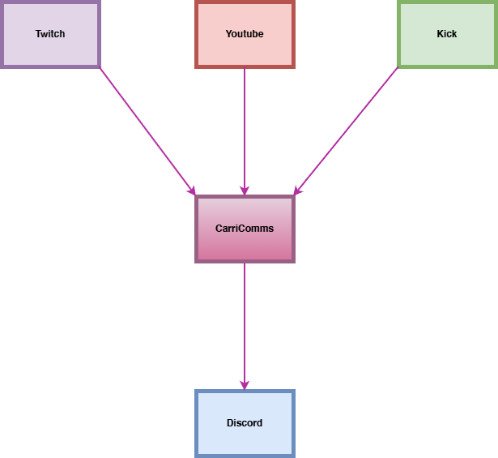

# **CarriComms**
### *Cross-platform chat relay for streamers.*

Routes Twitch, YouTube, and Kick messages into Discord — clean, secure, and built for creators who want all their comms in one place.

> **CarriComms = carry your comms — not your games.**  
No boosting. No gameplay carries. Just unified communication.

---

## 🚀 What is CarriComms?
CarriComms is a lightweight, multi-platform message relay tool that automatically forwards chat messages from **Twitch**, **YouTube**, and **Kick** into a single **Discord channel** via a secure bot instance.

It’s built to simplify stream moderation, archive chat activity, and give creators a unified hub for community engagement.

---

## ✨ Features (Public-Safe)
- **Discord Bot Integration**  
  Automatically creates or connects to a bot and routes messages into a chosen channel.

- **Multi-Platform Input**  
  Twitch, YouTube, and Kick.

- **Lightweight + Secure**  
  OAuth2 only. No passwords. No sensitive data stored.

- **Streamer-Friendly Message Handling**  
  Clean formatting + optional filters.

*(Private repo contains the full message logic + platform modules.)*

---

## 🛠 Status
🟩 **In active development (private repo)**  
🟧 **Public docs & branding available here**  
🟥 **Core code unreleased**

---

## 🔐 Security
CarriComms does **not** collect personal data.  
All authentication is done through official APIs.  
No analytics. No tracking. No machine learning.  
Just comms.

Full security documentation will be added at release.

---

## 📚 Documentation
- System overview (`/docs/overview.png`)
- Relay flow (`/docs/flow-diagram.png`)
- Basic setup guide (coming soon)

---

## 🛣 Public Roadmap (Safe)
- [ ] Public beta  
- [ ] Platform toggles  
- [ ] Auto-mod presets  
- [ ] Web UI Dashboard  
- [ ] Installer packages (Win/Mac/Linux)  
- [ ] Discord slash commands  
- [ ] Log viewer

---

## 📝 License
**Apache License 2.0**  
See `LICENSE` for details.

CarriComms © 2025 Nerine Aoi (byneriaoi)
